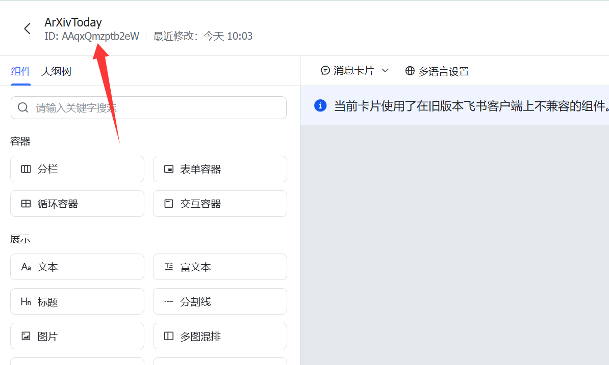

# 使用方法
### 1、创建群里机器人
进入群组，点击右上角的...图标 > 设置，找到 群机器人，并点击 添加机器人。

添加自定义机器人：在添加机器人页面点击 自定义机器人。设置机器人头像、名称、描述，点击 添加 即可。

###2、新建飞书卡片
https://open.feishu.cn/cardkit


将代码库中的ArXivToday.card 直接导入。



将id和version记住，一般version都是'1.0.0'


### 3、克隆仓库并修改代码
```bash
git clone https://github.com/mapengsen/Feishu_Arxiv_agent.git
conda create -n arxiv
conda activate arxiv
pip install -r requirements.txt
```


### 4、修改config.yaml中的代码:
完成其中的所有的TODO需要填写的东西


### 5、运行方式
```
python test_once.py --config confg.yaml
```


### 5.1、 周期性运行
例如，若要在每个工作日（weekday）的1:30（24小时制）查询 arXiv 论文并通过飞书机器人推送，可以：

使用如下命令打开 crontab 编辑器

```
crontab -e
```

写入命令（⚠️ 注意，这里需要填写绝对路径）：
```
30 1 * * * /home/mapengsen/anaconda3/bin/python /mnt/d/Pycharm_workspace/feishu_agent/Feishu_Arxiv_agent/main_periodic.py --config /mnt/d/Pycharm_workspace/feishu_agent/Feishu_Arxiv_agent/myconfg.yaml >> /mnt/d/Pycharm_workspace/feishu_agent/Feishu_Arxiv_agent/my_cron.log 2>&1
```


**备注：如果你发现没有执行，可能你用的WSL系统，cron没有启动，你需要启动cron**
执行Linux命令：
```
sudo service cron start
```

看一下是否成功执行起来了：
```
pgrep cron
```


## 其他
其中所有的历史paper都在：papers.json


## 修改日志
■ 2025年10月24日09:31:48 

    1. 修改页面布局，点击pdf链接直接进入pdf位置而不是正文位置
    2. 新增论文题目翻译


## 致谢
https://github.com/InfinityUniverse0/ArXivToday-Lark

https://www.feishu.cn/hc/zh-CN/articles/360024984973-%E5%9C%A8%E7%BE%A4%E7%BB%84%E4%B8%AD%E4%BD%BF%E7%94%A8%E6%9C%BA%E5%99%A8%E4%BA%BA

https://blog.csdn.net/weixin_45224842/article/details/145394003
